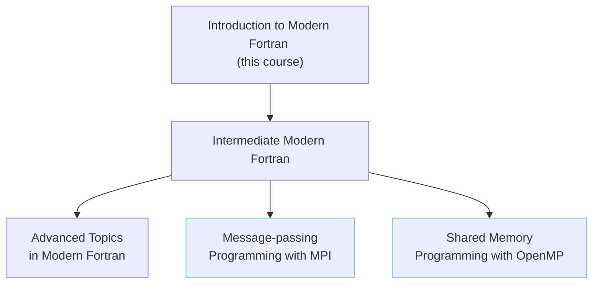

This page outlines how [this course][this-course-link] links to other Fortran lessons. Use the learning pathways on this page to decide if the course is right for you.

## Pathways

This course is merely an introduction to modern Fortran, and most learners will also want to take the Intermediate Modern Fortran course. If you work on HPC code you may also find the ARCHER2 MPI and OpenMP courses linked below useful.

